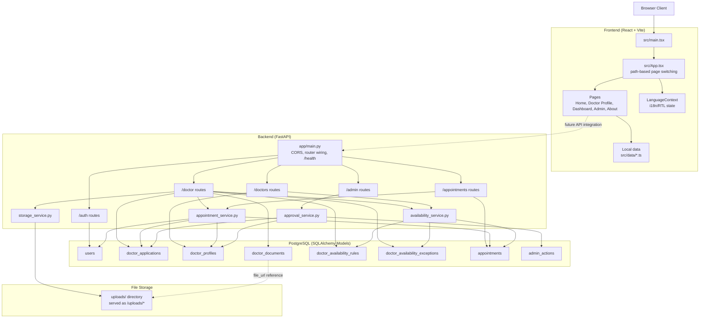

# Project Mermaid Diagram

```mermaid
flowchart TD
    Client["Browser Client"]

    subgraph FE["Frontend (React + Vite)"]
        Main["src/main.tsx"]
        App["src/App.tsx<br/>path-based page switching"]
        Pages["Pages<br/>Home, Doctor Profile, Dashboard, Admin, About"]
        LocalData["Local data<br/>src/data/*.ts"]
        Lang["LanguageContext<br/>i18n/RTL state"]
    end

    subgraph BE["Backend (FastAPI)"]
        FastAPI["app/main.py<br/>CORS, router wiring, /health"]
        Auth["/auth routes"]
        Doctor["/doctor routes"]
        Public["/doctors routes"]
        UserAppt["/appointments routes"]
        Admin["/admin routes"]
        AppointmentSvc["appointment_service.py"]
        AvailabilitySvc["availability_service.py"]
        ApprovalSvc["approval_service.py"]
        StorageSvc["storage_service.py"]
    end

    subgraph DB["PostgreSQL (SQLAlchemy Models)"]
        Users["users"]
        Applications["doctor_applications"]
        Profiles["doctor_profiles"]
        Documents["doctor_documents"]
        Rules["doctor_availability_rules"]
        Exceptions["doctor_availability_exceptions"]
        Appointments["appointments"]
        AdminActions["admin_actions"]
    end

    subgraph FS["File Storage"]
        Uploads["uploads/ directory<br/>served as /uploads/*"]
    end

    Client --> Main --> App --> Pages
    App --> Lang
    Pages --> LocalData
    Pages -. "future API integration" .-> FastAPI

    FastAPI --> Auth
    FastAPI --> Doctor
    FastAPI --> Public
    FastAPI --> UserAppt
    FastAPI --> Admin

    Doctor --> AppointmentSvc
    Doctor --> AvailabilitySvc
    Doctor --> StorageSvc
    Public --> AvailabilitySvc
    UserAppt --> AppointmentSvc
    Admin --> ApprovalSvc

    Auth --> Users
    Doctor --> Applications
    Doctor --> Documents
    Doctor --> Rules
    Doctor --> Exceptions
    Public --> Profiles
    UserAppt --> Appointments

    AppointmentSvc --> Users
    AppointmentSvc --> Profiles
    AppointmentSvc --> Applications
    AppointmentSvc --> Appointments

    AvailabilitySvc --> Rules
    AvailabilitySvc --> Exceptions
    AvailabilitySvc --> Appointments

    ApprovalSvc --> Applications
    ApprovalSvc --> Profiles
    ApprovalSvc --> AdminActions

    StorageSvc --> Uploads
    Documents -. "file_url reference" .-> Uploads
```

