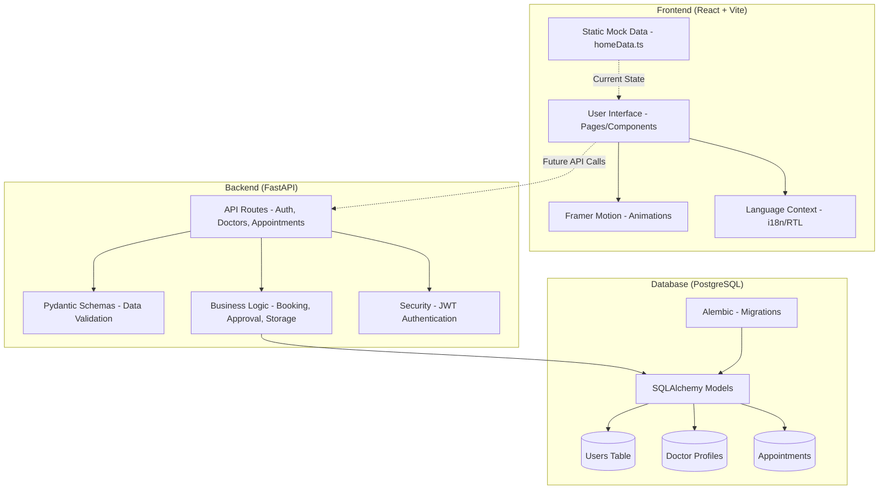

# Project Architecture

This diagram illustrates the flow of data and the structural relationship between the Frontend, Backend, and Database layers of the Doctor Booking platform.

### Component Breakdown

1.  **Frontend**: 
    *   **React & TypeScript**: Providing a type-safe, component-based UI.
    *   **Framer Motion**: Handling all the smooth staggered entries and hover effects implemented.
    *   **Tailwind CSS**: Managing the "Calm-tech" design system and RTL support.

2.  **Backend**:
    *   **FastAPI**: Asynchronous Python framework for high-performance API endpoints.
    *   **Services Layer**: Separates business logic (like checking doctor availability) from the API routing.

3.  **Data Layer**:
    *   **PostgreSQL**: Reliable relational storage for patient and doctor records.
    *   **SQLAlchemy**: ORM for mapping Python classes to database tables.
