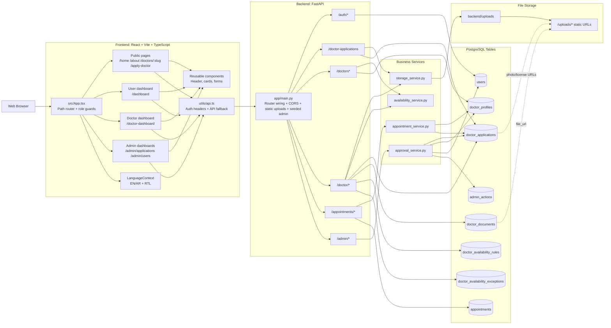
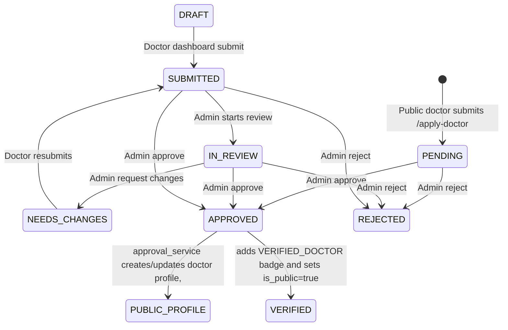

# Sabina Therapy Platform

Sabina Therapy is a full-stack mental health doctor-booking platform with role-based dashboards, doctor onboarding and admin review, and bilingual UX (English/Arabic with RTL support).

## Full Project Diagram



## Doctor Application Lifecycle



## Role Access Matrix

| Route/Area | USER | DOCTOR | ADMIN | Public |
|---|---|---|---|---|
| `/home`, `/about`, `/doctors/*` | ✅ | ✅ | ✅ | ✅ |
| `/apply-doctor` | ✅ | ✅ | ✅ | ✅ |
| `/dashboard` | ✅ | ❌ | ❌ | ❌ |
| `/doctor-dashboard` | ❌ | ✅ | ❌ | ❌ |
| `/admin/applications`, `/admin/users` | ❌ | ❌ | ✅ | ❌ |
| `/admin/*` API | ❌ | ❌ | ✅ | ❌ |

## Core Capabilities

- Public doctor application submission with secure file uploads and server-side validation.
- Admin review pipeline (pending/approved/rejected) with notes, preview, and approval actions.
- Approval creates or links DOCTOR account, publishes verified doctor profile, and makes doctor visible publicly.
- Public therapist directory with filtering + booking flows.
- JWT auth with `ADMIN`, `DOCTOR`, and `USER` roles.
- Arabic + English UI with RTL support.

## Repository Structure

```text
.
├─ src/                      # React frontend
│  ├─ pages/                 # App pages (/home, /apply-doctor, /admin/*, etc.)
│  ├─ components/            # Reusable UI components
│  ├─ context/               # Language and global context
│  └─ utils/                 # API/auth utilities
├─ backend/
│  ├─ app/
│  │  ├─ api/routes/         # FastAPI route modules
│  │  ├─ db/models/          # SQLAlchemy models
│  │  ├─ schemas/            # Pydantic schemas
│  │  └─ services/           # Business services
│  ├─ alembic/versions/      # Database migrations
│  ├─ tests/                 # Backend integration tests
│  └─ uploads/               # Uploaded files served via /uploads/*
├─ e2e/                      # Playwright E2E tests
├─ sabina-therapy-next/      # Separate Next.js prototype (not used by default docker stack)
└─ docker-compose.yml        # Root full-stack compose (frontend + app + postgres)
```

## Run the Project

### 1) Full stack with Docker (recommended)

```bash
docker compose up -d --build
```

Services:
- Frontend: `http://localhost:5173`
- Backend API: `http://localhost:8000`
- Swagger: `http://localhost:8000/docs`

If `5173` is busy:

```bash
FRONTEND_PORT=5174 docker compose up -d --build
```

Stop:

```bash
docker compose down
```

### 2) Frontend only

```bash
npm install
npm run dev
```

### 3) Backend only

```bash
cd backend
python -m venv .venv
source .venv/bin/activate
PYO3_USE_ABI3_FORWARD_COMPATIBILITY=1 pip install -r requirements.txt
alembic upgrade head
uvicorn app.main:app --reload
```

## Seeded Admin Account

The API seeds an admin user on startup:
- Email: `admin@sabina.dev`
- Password: `Admin12345!`

## Key API Surface

- Auth: `/auth/register`, `/auth/login`, `/auth/me`
- Public doctors: `/doctors`, `/doctors/slug/{slug}`, `/doctors/{doctor_user_id}`
- Public doctor applications: `POST /doctor-applications`
- Doctor dashboard APIs: `/doctor/application`, `/doctor/documents`, `/doctor/availability/*`
- User appointments: `/appointments/request`, `/appointments/my`, `/appointments/{id}/cancel`
- Admin review: `/admin/applications`, `/admin/applications/{id}`, `/admin/applications/{id}/approve`, `/admin/applications/{id}/reject`, `/admin/applications/{id}/note`

## Testing

Root scripts:

```bash
npm run build
npm run test
npm run test:e2e
```

Backend-only tests (Docker):

```bash
cd backend
make test-docker
```

## Security Controls Implemented

- Role-based protection for all privileged routes.
- JWT authentication and password hashing (`bcrypt`).
- Upload type and size restrictions for documents/photos.
- Duplicate public application prevention by email.
- Approved-only public doctor visibility rules.

## Tech Stack

- Frontend: React, TypeScript, Vite, Tailwind CSS, Framer Motion
- Backend: FastAPI, SQLAlchemy 2.x, Pydantic v2, Alembic
- Database: PostgreSQL
- Tests: Pytest (backend), Playwright (E2E)
