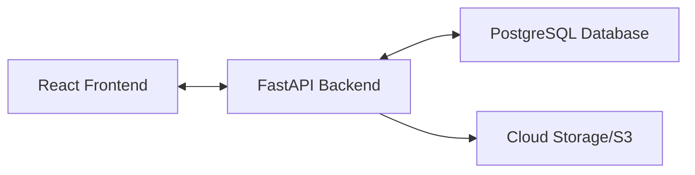

# MindCare - Modern Doctor Booking Platform

MindCare is a high-performance, full-stack medical booking platform designed with a focus on user experience, "calm-tech" aesthetics, and dual-language support (English & Arabic/RTL).

## 🚀 Key Features

### Frontend (React + Vite)
- **Modern Animations**: Powered by `framer-motion` with staggered reveals and smooth interactive states.
- **Multilingual Support**: Full i18n support for English and Arabic with automated RTL (Right-to-Left) layout switching.
- **Calm-Tech Design**: Custom "living" background animations and a clean, medical-grade aesthetic.
- **Dual Authentication**: Support for both Email/Password and Phone/Password login methods.
- **Google OAuth**: Integrated UI for Google Social Login.
- **Responsive Dashboards**: Specialized views for Patients, Doctors, and Admin users.

### Backend (FastAPI)
- **Asynchronous API**: Built with FastAPI for high-concurrency and speed.
- **Secure Auth**: JWT-based authentication with Bcrypt password hashing.
- **Flexible Data Model**: Supports Email, Phone, and Social login profiles.
- **PostgreSQL Database**: Relational storage using SQLAlchemy ORM.
- **Service-Oriented Logic**: Specialized services for appointment booking, availability management, and doctor verification.

## 🏗️ Architecture

The project follows a decoupled architecture. You can find the detailed system flow in `ARCHITECTURE_DIAGRAM.md`.



## 🛠️ Tech Stack

- **Frontend**: React 18, TypeScript, Tailwind CSS, Framer Motion, Vite.
- **Backend**: Python 3.10+, FastAPI, SQLAlchemy, Alembic (Migrations), Pydantic.
- **Database**: PostgreSQL.

## 🏃 Getting Started

### Frontend
```bash
# Install dependencies
npm install

# Start development server
npm run dev
```

### Backend
```bash
cd backend
# Create virtual environment
python -m venv venv
source venv/bin/activate # or venv\Scripts\activate on Windows

# Install dependencies
# If your python is 3.14+, use:
PYO3_USE_ABI3_FORWARD_COMPATIBILITY=1 pip install -r requirements.txt
# Otherwise:
# pip install -r requirements.txt

# Run server
uvicorn app.main:app --reload
```

## 📂 Project Structure

- `src/pages/`: Main application views (Home, Login, Profile, etc.)
- `src/components/`: Reusable UI components.
- `src/context/`: State management (Language, Auth).
- `backend/app/api/`: API endpoint definitions.
- `backend/app/db/`: Database models and session management.
- `backend/app/services/`: Core business logic.

## 🤝 Contribution
The project is currently in active development. Current focus is on connecting the frontend UI to the finalized backend services.
